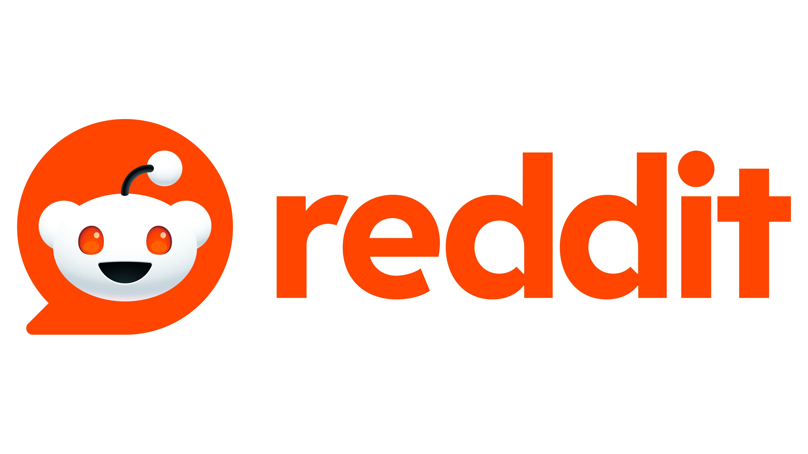

# reddit-schwab-analysis
Analyzing user sentiment around Schwab’s acquisition of TD Ameritrade using Reddit data
# 📊 Reddit Sentiment Analysis: TD Ameritrade x Charles Schwab Transition

## 🧠 Overview
Following the acquisition of TD Ameritrade by Charles Schwab, our team set out to understand how customers perceived the transition — particularly through the lens of Reddit user sentiment. By scraping posts and comments across three key subreddits, we conducted sentiment analysis, topic modeling, and influence detection to provide actionable insights to Charles Schwab.

## 🔍 Objective
**How do TD Ameritrade users feel about their migration to Charles Schwab — and what are the main concerns or praises voiced online?**

## 🔧 Methodology
- **Data Sources**: Reddit subreddits: `r/Schwab`, `r/TD Ameritrade`, and `r/Investing`
- **Scraping Criteria**:
  - Keywords: "TD" (in r/Schwab), "Schwab" (in r/TD Ameritrade & r/Investing)
  - Filters: Sorted by *Relevance* and *Past Year*
  - Collected: Top 5 posts from each subreddit + all related comments
- **Tools Used**: Python, Natural Language Processing (NLP), VADER for sentiment analysis, Topic Modeling (LDA), Word Clouds, Reddit API

## 📁 Dataset Summary
- **Total Rows**: 2,231
- **Subreddits**:
  - `r/Schwab`: 843
  - `r/TD Ameritrade`: 699
  - `r/Investing`: 689
- **Features Included**: Post titles, post body, comments, upvotes, downvotes, and sentiment scores.

## 📊 Key Findings
### 💬 Most Common Themes from Comments (via Topic Modeling)
1. **About the App** – User interface comparisons, missing features
2. **Account Transfer Issues** – Frustrations with delays or lost settings
3. **Alternatives** – Discussion of switching to Fidelity or other platforms

### 😀 Sentiment Analysis Results
- TD users showed significantly more **negative sentiment** in `r/Schwab` than in `r/TD Ameritrade`.
- The most upvoted comments were **critical but constructive**, often about UI/UX design.

### 🌟 Influencer Detection
- Identified 10 users who consistently posted high-engagement content across all subreddits.

## ⚖️ Comparative Study: TD x Schwab vs. E*TRADE x Morgan Stanley
To benchmark the TD x Schwab transition, we applied the same methodology to analyze E*TRADE’s acquisition by Morgan Stanley:

| Acquisition | Customer Sentiment | Integration Issues | Strategic Value |
|------------|---------------------|--------------------|------------------|
| TD x Schwab | Mixed, app complaints | Yes, usability drop | Strengthen online brokerage |
| E*TRADE x MS | Mostly positive | Few | Expand wealth management |

## 💡 Recommendations for Schwab
- **Engage Influencers**: Create a feedback group of the 10 most impactful Reddit users to drive platform improvements.
- **Restore Legacy Features**: Bring back features users loved from the TD app (e.g., Thinkorswim UI).
- **Enhance Support & Communication**: Improve onboarding communication for migrated users to reduce confusion.

## 📁 Appendices (in repo)
- Sentiment analysis visualizations
- Word clouds per subreddit
- Topic modeling graphs
- Side-by-side subreddit engagement tables

## 👥 Team Members
Jason Agyemang, Justin Smith, Falmata Wako, Julianne Wertz

---

> This project reflects a real-world NLP use case in finance, user experience research, and competitive benchmarking. 📈
